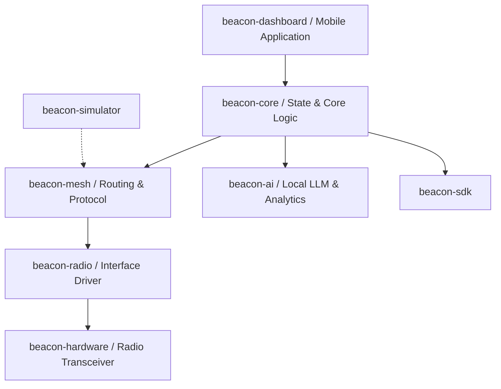

# Project Beacon

<div align="center">
  

  **Empowering Disaster-Resilient Mobile Communications & Coordination**

  [](LICENSE)
  [](PROJECT_STATUS.md)
  [](#)
  [](CONTRIBUTING.md)
</div>

---

## Mission
Project Beacon is an open-source, disaster-resilient mobile platform whose mission is to enable communication, coordination, navigation, and critical information sharing when conventional cellular networks and Internet infrastructure are completely unavailable.

## Vision
To create a decentralized, self-healing communication grid powered by ad-hoc mobile mesh networks, consumer-grade radio hardware, and offline-first software architectures—ensuring that no community is left disconnected during crises.

---

## Architecture Overview

The platform uses a layered architecture to separate radio hardware interfaces, mesh networking logic, and user-facing applications.



*(For more details, see the [Architecture Overview Document](docs/architecture/architecture_template.md).)*

---

## Key Features (Placeholders)

* **Ad-Hoc Mesh Networking:** Offline routing across peer-to-peer mobile nodes.
* **Resilient Messaging:** Decentralized text, location, and telemetry sharing.
* **Offline Maps & Navigation:** Vector tile loading and search using local spatial databases.
* **Multi-Transport Support:** Compatible with Bluetooth, Wi-Fi Direct, and LoRa/FSK radio transceivers.
* **Local Intelligence:** Offline AI assistants for triaging and emergency response assistance.

---

## Current Status

| Metric | Status / Value |
|--------|----------------|
| **Current Milestone** | [Milestone 1 — Foundation](ROADMAP.md) |
| **Current Version** | `v0.1.0-alpha` (Bootstrap Phase) |
| **Active Focus** | Documentation, Specs, and Architecture Scaffolding |

*(For full operational metrics, see [PROJECT_STATUS.md](PROJECT_STATUS.md).)*

---

## Roadmap
The following high-level milestones outline the strategic plan for Project Beacon:

1. **Milestone 1 — Foundation** (Current)
2. **Milestone 2 — Communication MVP**
3. **Milestone 3 — Mesh Networking**
4. **Milestone 4 — Offline Maps**
5. **Milestone 5 — Dashboard**
6. **Milestone 6 — Local AI**
7. **Milestone 7 — Radio Hardware**
8. **Milestone 8 — SDK**
9. **Milestone 9 — Beacon OS**

*(For detailed goals, check the full [ROADMAP.md](ROADMAP.md).)*

---

## Documentation

Detailed specifications and templates are located in the [docs/](docs/) and [adr/](adr/) directories:

- **Vision & Strategy:** [Vision Document](docs/vision/vision_template.md) | [Roadmap](ROADMAP.md)
- **Requirements:** [Product Requirements Document (PRD)](docs/prd/prd_template.md) | [Software Requirements Spec (SRS)](docs/srs/srs_template.md)
- **Technical Specs:** [Architecture Overview](docs/architecture/architecture_template.md) | [Protocol Specification](docs/protocol/protocol_template.md) | [Security Specification](docs/security/security_template.md)
- **Hardware & UX:** [Hardware Specification](docs/hardware/hardware_template.md) | [UI/UX Specification](docs/ui-ux/ui-ux_template.md)
- **Developers:** [SDK Specification](docs/sdk/sdk_template.md) | [Testing Strategy](docs/testing/testing_template.md) | [ADR Index](adr/ADR-0000-template.md)

---

## Repository Layout

```text
Project-Beacon/
├── .github/             # GitHub Issue templates, workflows, & community configs
├── docs/                # Comprehensive engineering, product, and design documentation
├── adr/                 # Architecture Decision Records (ADRs)
├── beacon-core/         # Central orchestration, data sync, and local storage engines
├── beacon-mesh/         # Ad-hoc routing protocol implementations
├── beacon-radio/        # Drivers and abstraction layers for radio hardware
├── beacon-dashboard/    # User-facing administration dashboard & app client
├── beacon-ai/           # Edge LLM and crisis assessment capabilities
├── beacon-sdk/          # Software Development Kit for third-party integrations
├── beacon-hardware/     # CAD files, PCB designs, and hardware bill-of-materials
├── beacon-os/           # Custom embedded Linux/RTOS distribution configurations
├── beacon-simulator/    # Simulation harness for mesh testing at scale
├── assets/              # Branding assets, diagrams, and static media
└── scripts/             # Build scripts, CI/CD helpers, and environment utilities
```

---

## Contributing

We welcome contributions from developers, researchers, UX designers, and hardware engineers. 

* Please read our [CONTRIBUTING.md](CONTRIBUTING.md) to learn about our branch naming conventions, commit formats, and pull request workflow.
* Ensure you abide by our [CODE_OF_CONDUCT.md](CODE_OF_CONDUCT.md).

---

## License
This project is licensed under the MIT License - see the [LICENSE](LICENSE) file for details.
