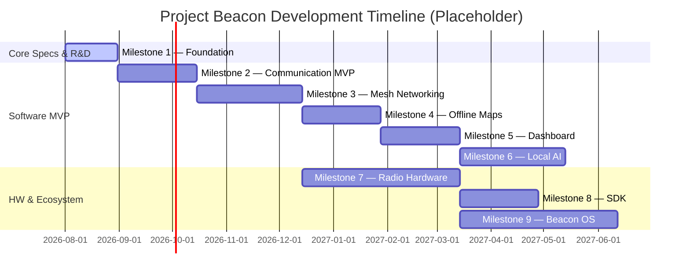

# Project Beacon Development Roadmap

This document outlines the milestones and strategic timeline for the development of Project Beacon.

---

## High-Level Timeline

---

## Milestones

### Milestone 1 — Foundation
* **Goal:** Architectural bootstrapping and baseline documentation definitions.
* **Status:** In Progress
* **Key Focus:** Specification templates, developer guidelines, initial simulated environment requirements.

### Milestone 2 — Communication MVP
* **Goal:** Core messaging pipeline implementation between direct peers.
* **Status:** Planned
* **Key Focus:** Direct link layer integration, local database storage, peer discovery.

### Milestone 3 — Mesh Networking
* **Goal:** Multi-hop packet routing and self-healing topologies.
* **Status:** Planned
* **Key Focus:** Ad-hoc mesh routing algorithm implementation, packet forwarders.

### Milestone 4 — Offline Maps
* **Goal:** Zero-network spatial indexing and rendering.
* **Status:** Planned
* **Key Focus:** Offline vector tiles database, pathfinding libraries, GIS integrations.

### Milestone 5 — Dashboard
* **Goal:** Central UI control client for nodes and gateways.
* **Status:** Planned
* **Key Focus:** Cross-platform user interface, local node configuration dashboard.

### Milestone 6 — Local AI
* **Goal:** Edge classification and crisis information summarization.
* **Status:** Planned
* **Key Focus:** Offline LLM inference pipelines, automated triage heuristics.

### Milestone 7 — Radio Hardware
* **Goal:** Custom off-grid physical transceiver integration.
* **Status:** Planned
* **Key Focus:** LoRa/FSK physical module schematics, custom enclosures, antenna tuning.

### Milestone 8 — SDK
* **Goal:** Third-party developer integration library.
* **Status:** Planned
* **Key Focus:** Multi-language wrappers, plugin architecture specifications, API documentation.

### Milestone 9 — Beacon OS
* **Goal:** Dedicated operating system configuration for bare-metal beacon stations.
* **Status:** Planned
* **Key Focus:** Hardened OS image recipes, OTA update infrastructure, headless boot configuration.
