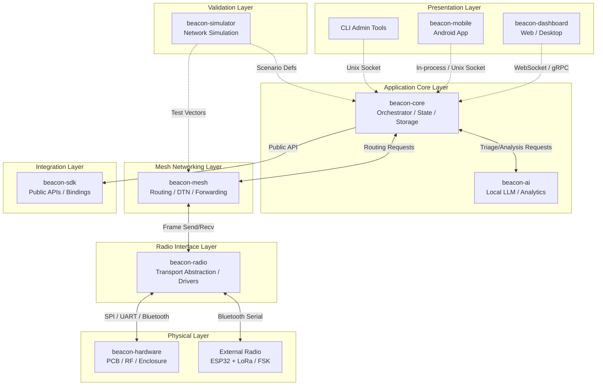
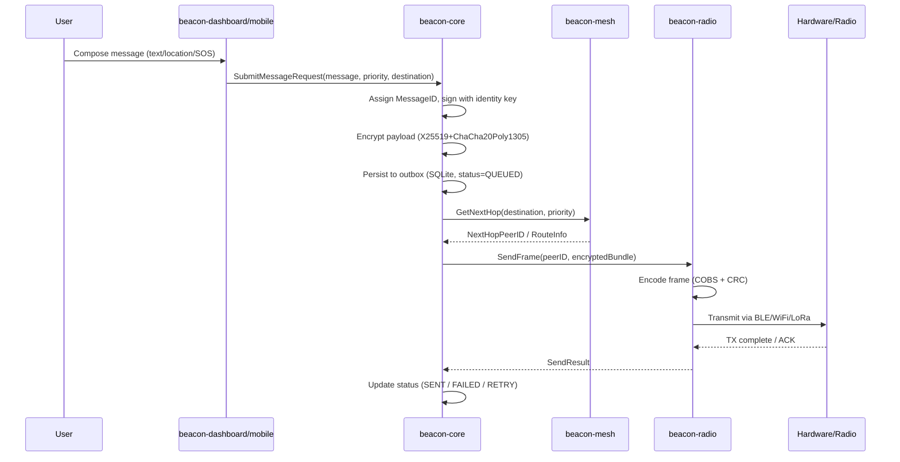
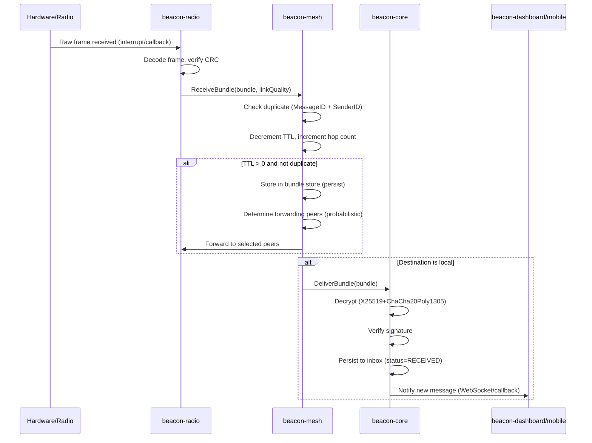
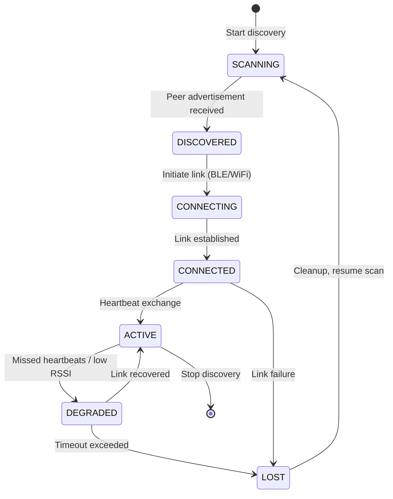
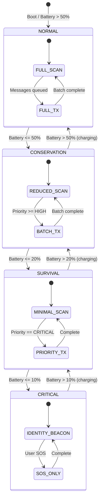

# Architecture Overview

## Document Metadata

* **Document ID:** `DOC-ARCH-001`
* **Version:** `1.0.0`
* **Status:** Approved
* **Author:** Project Beacon Core Team
* **Reviewers:** Project Beacon Maintainers
* **Last Updated:** 2026-08-20

---

## Purpose & Scope

### Purpose
The Architecture Overview provides a high-level conceptual model of Project Beacon's software modules, hardware divisions, and system communication paths. It guides core engineers on architectural patterns, modular boundaries, and component interaction rules.

### Scope
This covers the logical, physical, and process architectures of all `beacon-*` subprojects. Low-level interface implementations or individual class structures are left to module-specific documentation.

---

## Table of Contents

1. [Architectural Goals & Principles](#1-architectural-goals--principles)
2. [Logical Architecture (Layered View)](#2-logical-architecture-layered-view)
3. [Subproject Breakdown & Ownership](#3-subproject-breakdown--ownership)
4. [Core Data & Control Flows](#4-core-data--control-flows)
5. [Cross-Cutting Concerns](#5-cross-cutting-concerns)
6. [Deployment & Physical Topology](#6-deployment--physical-topology)
7. [References](#references)
8. [Revision History](#revision-history)

---

## Main Sections

### 1. Architectural Goals & Principles

#### 1.1 Modularity & Isolation
Each subproject operates as an independent module with clearly defined interfaces:
- `beacon-radio` must not directly depend on `beacon-dashboard`
- `beacon-mesh` knows nothing about UI or AI
- `beacon-core` orchestrates but does not implement transport logic
- Communication between modules occurs via well-defined APIs (gRPC, local sockets, or in-process interfaces)
- Each module can be tested, built, and versioned independently

#### 1.2 Resource Constraint Optimizations
- **Battery Conservation**: Duty-cycled radio operations; batch processing; sleep-first design
- **CPU Usage Constraints**: Background work limited to < 5% CPU average; no busy loops
- **Memory Pool Allocations**: Pre-allocated buffers for radio frames; zero-copy where possible
- **Storage Limits**: SQLite WAL mode; automatic cleanup of expired messages; configurable quotas

#### 1.3 Offline-First Principle
All core operations must run locally without external server dependencies:
- No mandatory cloud connectivity for any feature
- Opportunistic sync when Internet available (map updates, firmware)
- Local-first data model with conflict-free replicated data types (CRDTs) for mesh sync

#### 1.4 Security by Default
- End-to-end encryption at the application layer (above transport)
- Transport-agnostic security: BLE, Wi-Fi, LoRa all carry encrypted payloads
- Keys never leave secure enclave / Keystore
- Forward secrecy via ephemeral key agreement per session

#### 1.5 Observability Without Compromise
- Structured logging (JSON) with configurable verbosity
- Metrics exported via Prometheus-compatible endpoint (local only)
- No telemetry sent off-device without explicit user consent
- Log rotation and size limits to prevent storage exhaustion

---

### 2. Logical Architecture (Layered View)



**Layer Responsibilities**:

| Layer | Responsibility | Key Technologies |
|-------|----------------|------------------|
| **Presentation** | User interaction, visualization, configuration | Jetpack Compose (Android), React/TypeScript (Dashboard), Tauri (Desktop) |
| **Application Core** | State management, persistence, orchestration, scheduling | Kotlin/Rust, SQLite/SQLCipher, WorkManager |
| **Mesh Networking** | Routing, store-and-forward, DTN protocols, neighbor management | Custom DTN implementation, probabilistic flooding |
| **Radio Interface** | Transport abstraction, driver management, frame encoding | Android BLE/WiFi-Direct APIs, Bluetooth Serial (external) |
| **Physical** | PCB design, RF layout, firmware for dedicated nodes | KiCad, ESP-IDF, Zephyr RTOS |
| **Integration** | Public API surface, language bindings, plugin system | Kotlin, Swift, TypeScript, Python, C FFI |
| **Validation** | Simulation, testing, performance analysis | Python (simulator), Rust (core sim engine) |

---

### 3. Subproject Breakdown & Ownership

| Subproject | Primary Responsibility | Language | Key Interfaces |
|------------|------------------------|----------|----------------|
| **`beacon-core`** | Central orchestrator, database coordinator, state manager, scheduling, power management | Kotlin (Android) / Rust (core lib) | `CoreApi`, `StorageApi`, `PowerApi`, `IdentityApi` |
| **`beacon-mesh`** | Decentralized packet routing, topology formation, neighbor discovery, DTN bundle protocol | Rust | `MeshApi`, `RoutingApi`, `BundleApi`, `NeighborApi` |
| **`beacon-radio`** | Physical chip abstraction (LoRa, BLE, WiFi), frame encoding/decoding, link management | Kotlin (Android drivers) / Rust (protocol codecs) | `TransportApi`, `RadioDriver`, `FrameCodec` |
| **`beacon-sdk`** | Unified entry-point APIs for application integration, language bindings | Kotlin, Swift, TypeScript, Python, C | `BeaconClient`, `MessageApi`, `PeerApi`, `MapApi` |
| **`beacon-dashboard`** | Web and desktop status interfaces, administration, visualization | TypeScript, React, MapLibre GL, Tauri | Consumes `beacon-sdk` |
| **`beacon-ai`** | Edge LLM inference, crisis assessment, summarization, translation | Python (model runtime), Rust (integration) | `AiApi`, `InferenceEngine`, `KnowledgeBase` |
| **`beacon-hardware`** | Physical board configurations, RF design, BOM, enclosure CAD | KiCad, FreeCAD, OpenSCAD | Gerber, STEP, BOM CSV |
| **`beacon-os`** | Custom embedded Linux/RTOS distribution configurations | Yocto, Buildroot, Shell | Disk images, OTA manifests |
| **`beacon-simulator`** | Simulation harness for mesh testing at scale | Python (scenario), Rust (core engine) | `SimulatorApi`, `ScenarioDsl`, `MetricsExport` |

---

### 4. Core Data & Control Flows

#### 4.1 Message Transmit Flow


#### 4.2 Message Receive Flow


#### 4.3 Peer Discovery & Neighbor Management


#### 4.4 Power Management State Machine


---

### 5. Cross-Cutting Concerns

#### 5.1 Security & Encryption
*Detailed cryptosystems overview. (See also [Security Specification](../security/security.md)).*

| Layer | Mechanism | Algorithm | Key Management |
|-------|-----------|-----------|----------------|
| **Identity** | Long-term signing | Ed25519 | Android Keystore / Secure Enclave |
| **Session** | Key agreement | X25519 (ECDH) | Ephemeral per session |
| **Message** | Authenticated encryption | ChaCha20-Poly1305 | Derived from session key |
| **Transport** | Link-layer (optional) | AES-CCM (BLE), AES-GCM (WiFi) | Platform managed |
| **Storage** | Encryption at rest | SQLCipher (AES-256) | Key derived from user passphrase + hardware |

**Threat Model Coverage**:
- Passive eavesdropping: ✅ E2E encryption
- Active injection/modification: ✅ AEAD + signatures
- Replay attacks: ✅ Nonce + timestamp + sequence
- Identity spoofing: ✅ Ed25519 signatures
- Metadata analysis: ⚠️ Partial (traffic analysis resistant routing TBD)
- Compromised device: ✅ Key rotation, forward secrecy
- Sybil attacks: 🔄 Reputation-based (Phase 6)

#### 5.2 Logging & Observability
- **Format**: JSON Lines with structured fields
- **Levels**: ERROR, WARN, INFO, DEBUG, TRACE
- **Fields**: timestamp, level, module, trace_id, span_id, message, key_values
- **Storage**: Circular buffer in memory (10k entries) + daily rotating files (max 100MB)
- **Export**: Local HTTP endpoint (`/metrics`, `/logs`) for dashboard scraping
- **Privacy**: No PII in logs; message IDs only, no payloads

#### 5.3 Configuration Management
- **Source**: Encrypted JSON in app-private storage
- **Schema**: Versioned with migration logic
- **Runtime Updates**: Hot-reload for non-critical params (scan intervals, TTL)
- **Persistence**: Critical config (identity keys) in Keystore

#### 5.4 Error Handling & Resilience
- **Transport Failures**: Exponential backoff + circuit breaker per peer
- **Storage Errors**: WAL checkpoint + integrity check on boot
- **OOM Prevention**: Bounded queues, backpressure to UI
- **Watchdog**: Periodic self-health check; restart components on stall

---

### 6. Deployment & Physical Topology

#### 6.1 Android Deployment (Primary)
```
┌─────────────────────────────────────────┐
│           Android Device                │
├─────────────────────────────────────────┤
│  ┌─────────────────────────────────┐    │
│  │ beacon-mobile (APK/AAB)         │    │
│  │  ├─ UI (Compose)                │    │
│  │  ├─ Core (in-process)           │    │
│  │  ├─ Mesh (in-process)           │    │
│  │  ├─ Radio (Android APIs)        │    │
│  │  └─ AI (optional, dynamic)      │    │
│  └─────────────────────────────────┘    │
│                    │                    │
│  ┌─────────────────────────────────┐    │
│  │ Android System                  │    │
│  │  ├─ BLE / WiFi-Direct Stack     │    │
│  │  ├─ Keystore / Biometric        │    │
│  │  ├─ WorkManager / AlarmManager  │    │
│  │  └─ Foreground Service          │    │
│  └─────────────────────────────────┘    │
└─────────────────────────────────────────┘
```

#### 6.2 Dedicated Node Deployment (Beacon Radio)
```
┌─────────────────────────────────────────┐
│         Beacon Radio Node               │
├─────────────────────────────────────────┤
│  ┌─────────────────────────────────┐    │
│  │ ESP32-S3 / nRF52840             │    │
│  │  ├─ Zephyr RTOS / ESP-IDF       │    │
│  │  ├─ beacon-radio firmware       │    │
│  │  ├─ LoRa (SX1262/1276)          │    │
│  │  ├─ BLE 5.0                     │    │
│  │  └─ USB-C / Solar / Battery     │    │
│  └─────────────────────────────────┘    │
│                    │                    │
│         Bluetooth Serial               │
│                    ▼                    │
└─────────────────────────────────────────┘
              │
              ▼
┌─────────────────────────────────────────┐
│         Android Phone                   │
│  (beacon-mobile + beacon-radio driver)  │
└─────────────────────────────────────────┘
```

#### 6.3 Gateway / Server Deployment (Optional)
```
┌─────────────────────────────────────────┐
│         Raspberry Pi / SBC              │
├─────────────────────────────────────────┤
│  ┌─────────────────────────────────┐    │
│  │ Beacon OS (Yocto/Buildroot)     │    │
│  │  ├─ beacon-core (headless)      │    │
│  │  ├─ beacon-mesh                 │    │
│  │  ├─ beacon-radio (USB/Serial)   │    │
│  │  ├─ beacon-dashboard (web)      │    │
│  │  └─ OTA Update Server           │    │
│  └─────────────────────────────────┘    │
└─────────────────────────────────────────┘
```

---

### 7. References

* [Vision Document](../vision/vision.md)
* [Product Requirements Document](../prd/prd.md)
* [Software Requirements Specification](../srs/srs.md)
* [Protocol Specification](../protocol/protocol.md)
* [Security Specification](../security/security.md)
* [ADR-0001: Primary Local Discovery Mechanism](../adr/ADR-0001-ble-discovery.md)
* [ADR-0002: Offline GIS Database Engine Selection](../adr/ADR-0002-gis-database.md)

---

## Revision History

| Date | Version | Description | Author |
|------|---------|-------------|--------|
| 2026-08-20 | 1.0.0 | Initial approved architecture | Project Beacon Core Team |

---

## Approval

**Status: APPROVED** ✅