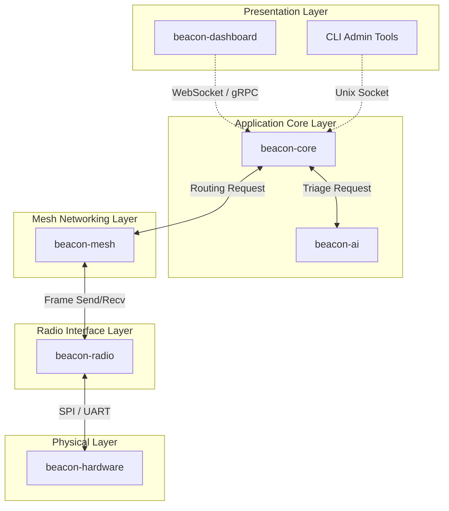

# Architecture Overview Template

## Document Metadata

* **Document ID:** `DOC-ARCH-001`
* **Version:** `0.1.0`
* **Status:** Draft / Proposed
* **Author:** *Placeholder Author*
* **Reviewers:** *Placeholder Reviewer 1, Placeholder Reviewer 2*
* **Last Updated:** *Placeholder Date*

---

## Purpose & Scope

### Purpose
The Architecture Overview provides a high-level conceptual model of Project Beacon's software modules, hardware divisions, and system communication paths. It guides core engineers on architectural patterns, modular boundaries, and component interaction rules.

### Scope
This covers the logical, physical, and process architectures of all `beacon-*` subprojects. Low-level interface implementations or individual class structures are left to module-specific documentation.

---

## Table of Contents

1. [Architectural Goals & Principles](#1-architectural-goals--principles)
2. [Logical Architecture (Layered View)](#2-logical-architecture-layered-view)
3. [Subproject Breakdown & Ownership](#3-subproject-breakdown--ownership)
4. [Core Data & Control Flows](#4-core-data--control-flows)
5. [Cross-Cutting Concerns](#5-cross-cutting-concerns)
6. [Deployment & Physical Topology](#6-deployment--physical-topology)
7. [References](#references)
8. [Revision History](#revision-history)

---

## Main Sections

### 1. Architectural Goals & Principles

#### 1.1 Modularity & Isolation
*Describe how each subproject operates as an independent module (e.g. `beacon-radio` must not directly depend on `beacon-dashboard`).*

#### 1.2 Resource Constraint Optimizations
*Explain battery conservation, CPU usage constraints, and memory pool allocations.*

#### 1.3 Offline-First Principle
*State that all core operations must run locally without external server dependencies.*

---

### 2. Logical Architecture (Layered View)

---

### 3. Subproject Breakdown & Ownership

* **`beacon-core`**: Primary orchestrator, database coordinator, state manager.
* **`beacon-mesh`**: Decentralized packet routing, topology formation, neighbor discovery.
* **`beacon-radio`**: Physical chip abstraction (LoRa, BLE, WiFi).
* **`beacon-sdk`**: Unified entry-point APIs for application integration.
* **`beacon-dashboard`**: Web and desktop status interfaces.
* **`beacon-hardware`**: Physical board configurations and RF design.

---

### 4. Core Data & Control Flows

#### 4.1 Message Transmit Flow
1. User interacts with UI in `beacon-dashboard`.
2. UI submits message request to `beacon-core` over Local WebSocket/API.
3. `beacon-core` serializes, signs, and packets the message.
4. `beacon-core` queries `beacon-mesh` for next-hop routing address.
5. `beacon-mesh` wraps the payload in a routing frame and passes to `beacon-radio`.
6. `beacon-radio` transmits the physical signal via UART/SPI to the RF transceiver in `beacon-hardware`.

---

### 5. Cross-Cutting Concerns

#### 5.1 Security & Encryption
*Detailed cryptosystems overview. (See also [Security Specification](docs/security/security_template.md)).*

#### 5.2 Logging & Observability
*Log formats, verbosity controls, and persistent storage constraints.*

---

### 6. Deployment & Physical Topology
*Details on deployment onto microcontrollers, edge computers (e.g. Raspberry Pi), and companion smartphones.*

---

## References

* *[Ref-01] Placeholder Architecture Reference*

---

## Revision History

| Date | Version | Description | Author |
|---|---|---|---|
| YYYY-MM-DD | 0.1.0 | Initial template layout. | Antigravity |
