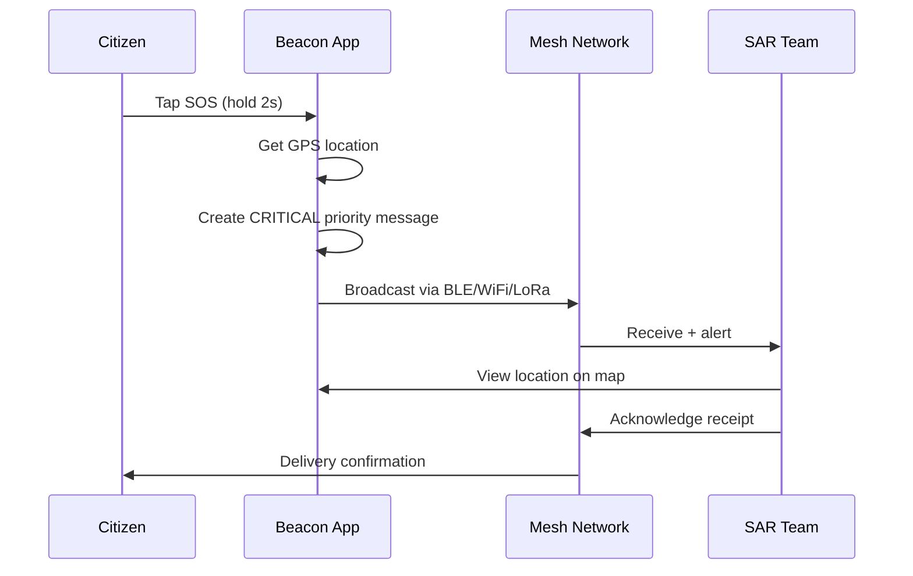

# Product Requirements Document (PRD)

## Document Metadata

* **Document ID:** `DOC-PRD-001`
* **Version:** `1.0.0`
* **Status:** Approved
* **Author:** Project Beacon Core Team
* **Reviewers:** Project Beacon Maintainers
* **Last Updated:** 2026-08-20

---

## Purpose & Scope

### Purpose
This PRD outlines the specific features, user experiences, and functional requirements for the Project Beacon platform. It translates the vision into actionable requirements for engineering, design, and validation.

### Scope
This covers the user-facing mobile application, node administration dashboard, core system states, and external hardware API requirements for Milestones 1-5. Technical protocols, message formats, and specific hardware layout plans are covered in the SRS and protocol specifications.

---

## Product Objectives & Goals

### Core Objectives

| Objective | Metric | Target |
|-----------|--------|--------|
| **OBJ-COMM-001** | Message delivery latency (direct peer) | < 5 seconds p95 |
| **OBJ-COMM-002** | Message delivery success rate (direct peer) | > 95% |
| **OBJ-MESH-001** | Multi-hop delivery (3 hops) | > 80% success |
| **OBJ-MESH-002** | Store-and-forward delivery (30 min partition) | > 70% success |
| **OBJ-MAP-001** | Offline map render frame time | < 16ms (60fps) |
| **OBJ-MAP-002** | POI search latency (local) | < 100ms p95 |
| **OBJ-POWER-001** | Idle battery drain (background) | < 5%/hour |
| **OBJ-POWER-002** | Active messaging battery drain | < 15%/hour |
| **OBJ-SEC-001** | E2E encryption for all messages | 100% |
| **OBJ-SEC-002** | Forward secrecy | Yes |
| **OBJ-UX-001** | SOS activation time | < 3 taps, < 2 seconds |
| **OBJ-UX-002** | App cold start to ready | < 3 seconds |

### Out of Scope (This Version)
- Real-time audio/video streaming over mesh
- Desktop client parity (Phase 5+)
- iOS support (Android-first; iOS Phase 6+)
- Satellite communication integration
- Blockchain or token economics
- Centralized cloud services for core features

---

## User Persona Definitions

### Persona A: Emergency Manager (SAR Lead / Incident Commander)
- **Context**: Coordinating search & rescue in disaster zone
- **Device**: Rugged Android phone + Beacon Radio Node
- **Needs**:
  - Team location tracking on offline map
  - Group broadcast messaging (priority tiers)
  - Resource markers (water, medical, shelter, hazards)
  - Network health visualization (node count, connectivity)
  - Battery-aware routing for team devices
- **Frustrations**:
  - Fragmented comms (radio, phone, satellite, runners)
  - No unified location picture
  - Battery anxiety during multi-day ops
  - Paper maps outdated, no real-time updates

### Persona B: Impacted Citizen (Disaster Victim)
- **Context**: Trapped/isolated, seeking help and information
- **Device**: Personal Android phone (no prep)
- **Needs**:
  - One-tap SOS with location
  - Receive alerts (evacuation, boil water, road closure)
  - Find nearest water/shelter/medical
  - Message family (low bandwidth, high priority)
  - Minimal battery usage
- **Frustrations**:
  - Complex apps requiring account creation
  - Fast battery drain from background scanning
  - Confusing UI during panic
  - False alarm SOS triggers

### Persona C: Community Volunteer (CERT / Mutual Aid)
- **Context**: Neighborhood response, resource distribution
- **Device**: Personal Android + possibly Beacon Radio
- **Needs**:
  - Report resource availability (water, food, charging)
  - Verify reports from others
  - Coordinate with neighbors via mesh
  - Share status with formal response
- **Frustrations**:
  - Unverified rumors spreading
  - No way to distinguish official vs. community info
  - Tools require Internet to sync

### Persona D: Remote/Off-Grid User (Hiker, Rural Resident)
- **Context**: Chronic low/no connectivity
- **Device**: Android phone + Beacon Radio Node (permanent)
- **Needs**:
  - Always-on mesh node for community
  - Message store-and-forward
  - Weather/alert receive
  - Multi-day battery on node
- **Frustrations**:
  - Expensive satellite communicators
  - Proprietary ecosystems (Garmin, Zoleo)

---

## User Journeys & Stories

### Journey 1: Emergency SOS Broadcast (Persona B)


**User Story**: *As a disconnected citizen in a flood zone, I want to send an encrypted, low-bandwidth distress signal containing my GPS coordinates, so that nearby rescue teams can view my location on their offline dashboard.*

**Acceptance Criteria**:
- [ ] SOS activatable from lock screen / notification tile
- [ ] 2-second hold prevents accidental activation
- [ ] Includes: GPS (if available), timestamp, user ID, battery level
- [ ] Priority: CRITICAL (highest queue priority, lowest TTL)
- [ ] Auto-retry with exponential backoff until acknowledged
- [ ] Visual/audio confirmation when delivered

### Journey 2: Group Route Sharing (Persona A)
**User Story**: *As a search and rescue team lead, I want to broadcast a safe search route map overlay to my team, so that everyone coordinates their search area without cell coverage.*

**Acceptance Criteria**:
- [ ] Import GPX/KML or draw route on map
- [ ] Attach metadata: team ID, mission name, expiry time
- [ ] Broadcast as HIGH priority
- [ ] Recipients see route overlay on their map
- [ ] Route persists offline for mission duration

### Journey 3: Community Resource Reporting (Persona C)
**User Story**: *As a community volunteer, I want to report a working water source at the community center, so that neighbors can find it on their offline map.*

**Acceptance Criteria**:
- [ ] Report types: Water, Food, Medical, Shelter, Charging, Hazard, Road Closed
- [ ] Required: Location, type, description, reporter confidence (1-5)
- [ ] Optional: Photo (compressed), expiry time
- [ ] Signed with reporter's identity key
- [ ] Aggregated on dashboard with confidence scoring
- [ ] Expires automatically (default 24h)

### Journey 4: Multi-Hop Message Delivery (Persona A/B)
**User Story**: *As a team member beyond direct radio range, I want my messages to relay through teammates, so I stay connected to command.*

**Acceptance Criteria**:
- [ ] Up to 5 hops supported
- [ ] TTL decremented per hop
- [ ] Duplicate detection via message ID
- [ ] Store-and-forward when next hop unavailable
- [ ] Priority queue: CRITICAL > HIGH > NORMAL > LOW

### Journey 5: Power-Aware Operation (Persona B/D)
**User Story**: *As a user with 15% battery, I want the app to automatically enter survival mode, so I can still send SOS but preserve power.*

**Acceptance Criteria**:
- [ ] Survival mode at < 20% battery (configurable)
- [ ] Survival mode: ONLY CRITICAL/HIGH messages, minimal scanning
- [ ] Critical mode at < 10%: ONLY SOS, identity beacon
- [ ] User can manually override modes
- [ ] Battery level shared with mesh for energy-aware routing

---

## Functional Requirements (MoSCoW)

### M — Must Have (Milestone 2-3)

| ID | Requirement | Description |
|----|-------------|-------------|
| **REQ-COMM-001** | BLE Transport | Bluetooth Low Energy for discovery and small messages (< 512 bytes) |
| **REQ-COMM-002** | Wi-Fi Direct Transport | Wi-Fi P2P for high-bandwidth transfers (> 512 bytes, images, maps) |
| **REQ-COMM-003** | Peer Discovery | Automatic nearby peer detection without user intervention |
| **REQ-COMM-004** | Message Persistence | All messages stored locally (SQLite) with delivery status |
| **REQ-COMM-005** | Priority Queue | Four-tier priority (CRITICAL, HIGH, NORMAL, LOW) affects retry/TTL |
| **REQ-COMM-006** | Duplicate Detection | Message ID + sender ID prevents reprocessing |
| **REQ-COMM-007** | TTL / Hop Limit | Configurable TTL (default 5) and hop count per message |
| **REQ-COMM-008** | E2E Encryption | X25519 + ChaCha20-Poly1305 for all payloads |
| **REQ-COMM-009** | Identity Keys | Ed25519 keypair per device; public key = identity |
| **REQ-MESH-001** | Multi-hop Routing | Flooding with probabilistic forwarding (Phase 3+) |
| **REQ-MESH-002** | Store-and-Forward | Queue messages when no peers; deliver on reconnect |
| **REQ-MESH-003** | Neighbor Table | Track peer signal quality, battery, last seen |
| **REQ-CORE-001** | Local Database | SQLite with SQLCipher for encryption at rest |
| **REQ-CORE-002** | Background Service | Foreground service for mesh participation |
| **REQ-CORE-003** | Power Management | Battery-level aware duty cycling |
| **REQ-SEC-001** | Secure Storage | Android Keystore for private keys |
| **REQ-SEC-002** | Replay Protection | Nonce/timestamp per message |
| **REQ-SEC-003** | Metadata Minimization | No plaintext sender/recipient in headers |

### S — Should Have (Milestone 4-5)

| ID | Requirement | Description |
|----|-------------|-------------|
| **REQ-MAP-001** | Offline Vector Maps | MBTiles/Protobuf vector tiles rendered via MapLibre |
| **REQ-MAP-002** | POI Database | Pre-packaged OSM POIs (hospitals, shelters, water) |
| **REQ-MAP-003** | Resource Markers | Community-reported markers sync via mesh |
| **REQ-MAP-004** | On-device Routing | Valhalla/OSRM offline routing engine |
| **REQ-DASH-001** | Network Dashboard | Nearby nodes, signal quality, battery, mesh topology |
| **REQ-DASH-002** | Resource Dashboard | Filterable resource map with confidence scores |
| **REQ-DASH-003** | Alert Panel | Broadcast alerts with severity, expiry, geographic scope |
| **REQ-AI-001** | Offline LLM | Quantized model (1-3B params) for summarization |
| **REQ-AI-002** | Procedure Guidance | Offline first aid / emergency procedure lookup |

### C — Could Have (Milestone 6+)

| ID | Requirement | Description |
|----|-------------|-------------|
| **REQ-RADIO-001** | LoRa Transport | External ESP32/LoRa via Bluetooth serial |
| **REQ-RADIO-002** | Radio Abstraction | Pluggable transport interface for new radios |
| **REQ-ADV-001** | Energy-Aware Routing | Route prefers high-battery nodes |
| **REQ-ADV-002** | Reputation System | Report confidence via multi-source verification |
| **REQ-ADV-003** | Voice Notes | Compressed Opus audio messages (HIGH priority) |
| **REQ-ADV-004** | Mesh Telemetry | Node health, link quality, traffic stats |

### W — Won't Have (This Phase)

| ID | Requirement | Reason |
|----|-------------|--------|
| **REQ-NO-001** | iOS Support | Android-first; Swift port later |
| **REQ-NO-002** | Desktop App | Web dashboard first; native desktop later |
| **REQ-NO-003** | Satellite Integration | Requires hardware partnerships |
| **REQ-NO-004** | Group Key Rotation | Complexity; pairwise keys sufficient for MVP |
| **REQ-NO-005** | Mesh Name Service | Human-readable names; use key fingerprints for MVP |

---

## UX/UI Requirements & Wireframes

### Screen A: Hub Map (Primary)
```
┌─────────────────────────────────────┐
│  BEACON          [⋮] [🔋 87%]       │
├─────────────────────────────────────┤
│                                     │
│        [MAP VIEWPORT]               │
│   ● You                             │
│   ◆ Node A (2.3km, -67dBm)          │
│   ◆ Node B (4.1km, -72dBm)          │
│   💧 Water (confirmed 3/3)          │
│   🏥 Medical (confirmed 2/3)        │
│   ⚠️ Hazard: Flooded road           │
│                                     │
├─────────────────────────────────────┤
│  [📍] [💬] [🚨 SOS] [📊] [⚙️]        │
└─────────────────────────────────────┘
```

### Screen B: Emergency Panel
```
┌─────────────────────────────────────┐
│  EMERGENCY                          │
├─────────────────────────────────────┤
│                                     │
│        ╔════════════════╗          │
│        ║   SEND SOS     ║          │
│        ║  Hold 2 sec    ║          │
│        ╚════════════════╝          │
│                                     │
│  Includes: Location, Battery, ID    │
│  Priority: CRITICAL                 │
│  Retry: Until acknowledged          │
│                                     │
│  [Medical]  [Shelter]  [Evacuate]   │
│  [Custom Message...]                │
│                                     │
├─────────────────────────────────────┤
│  Recent: 3 min ago - Delivered ✓    │
└─────────────────────────────────────┘
```

### Screen C: Message Thread
```
┌─────────────────────────────────────┐
│  Team Alpha                    [⋮]  │
├─────────────────────────────────────┤
│  ● 14:32  You: "At checkpoint 3"   │
│  ◆ 14:33  Node A: "Copy, en route" │
│  ● 14:35  You: [Location]           │
│  ◆ 14:36  Node A: ✓ Delivered       │
├─────────────────────────────────────┤
│  [Type message...] [📎] [📍] [🎤]   │
└─────────────────────────────────────┘
```

### Screen D: Network Dashboard
```
┌─────────────────────────────────────┐
│  NETWORK                        [⋮] │
├─────────────────────────────────────┤
│  Nodes: 12 nearby | 47 in mesh      │
│  ┌─────────────────────────────┐    │
│  │ [TOPOLOGY GRAPH]            │    │
│  └─────────────────────────────┘    │
│  Peer List:                         │
│  ◆ Phone-A8F2  -62dBm  94%  2m ago  │
│  ◆ Radio-Node3 -71dBm  67%  5m ago  │
│  ◆ Phone-4K9L  -78dBm  23%  1m ago  │
├─────────────────────────────────────┤
│  [Rescan] [Share Node] [Settings]   │
└─────────────────────────────────────┘
```

---

## Open Product Questions

| ID | Question | Status |
|----|----------|--------|
| **OPQ-001** | Support iOS CoreBluetooth alongside Android? | Deferred to Phase 6 |
| **OPQ-002** | Require phone number / email for identity? | No — cryptographic identity only |
| **OPQ-003** | Allow unencrypted "public" channels? | No — all traffic encrypted by default |
| **OPQ-004** | Mesh TTL default value? | 5 hops (configurable via settings) |
| **OPQ-005** | Maximum message size? | 64KB (fragmented across transports) |
| **OPQ-006** | Background execution limits on Android 14+? | Foreground service + exemptions |
| **OPQ-007** | Map data update mechanism? | Mesh sync + manual USB/sideload |
| **OPQ-008** | Handle malicious/spam nodes? | Rate limiting + reputation (Phase 6) |
| **OPQ-009** | Group messaging vs. broadcast? | Broadcast for MVP; groups Phase 4 |
| **OPQ-010** | GPS required or optional? | Optional; coarse location fallback |

---

## References

* [Vision Document](vision.md)
* [Architecture Overview](../architecture/architecture.md)
* [Security Specification](../security/security.md)
* [UI/UX Specification](../ui-ux/ui-ux.md)
* [Protocol Specification](../protocol/protocol.md)

---

## Revision History

| Date | Version | Description | Author |
|------|---------|-------------|--------|
| 2026-08-20 | 1.0.0 | Initial approved PRD | Project Beacon Core Team |

---

## Approval

**Status: APPROVED** ✅